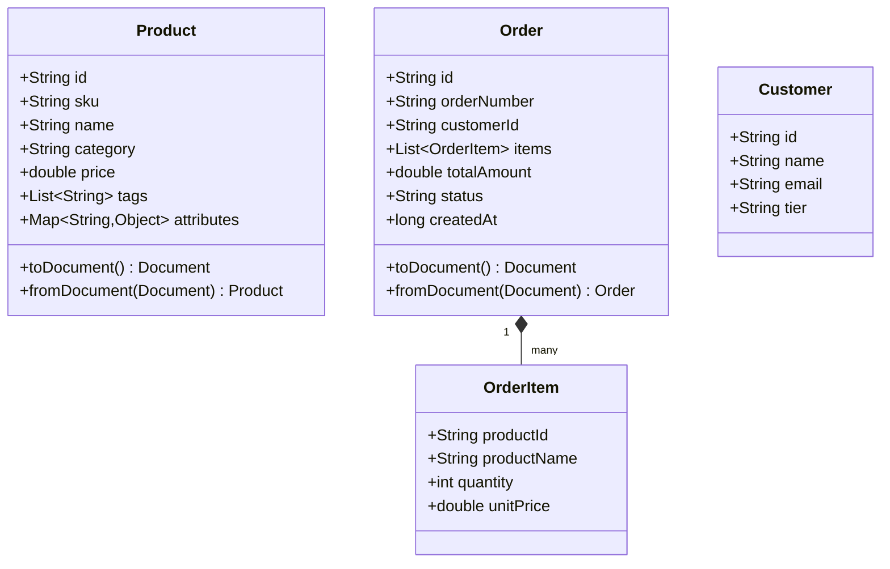

# JunifyDB Demonstration Suite Architecture

## Unified Domain Model: E-Commerce & Order Management

To ensure fair, comparable, and realistic evaluation across all framework ecosystems, every demo implements the exact same canonical domain:



---

## Multi-Model Storage Architecture

JunifyDB powers this application across three concurrent NoSQL models within the same database engine:

| Data Layer | Model Type | Container Name | Responsibilities | Engine Behavior |
|---|---|---|---|---|
| **Product Catalog** | Document | `products` | Document search, JSON attributes, secondary index by category | Inverted index & JSON serde |
| **Price Cache** | Key-Value | `price_cache` | High-speed cache for real-time product price lookups | Sub-millisecond O(1) reads |
| **Warehouse Stock** | Wide-Column | `inventory` | Multi-warehouse inventory balances with atomic updates | Key-row-column addressing |
| **Order History** | Document | `orders` | Transactional order placement records | ACID MVCC protected |

---

## Framework Integration Architecture

```mermaid
graph TB
    subgraph SpringBoot["Spring Boot Demo"]
        SB_C[EcommerceController] --> SB_S[ProductService / OrderService]
        SB_S --> SB_T[JunifyDBTemplate]
        SB_T --> Core_SB[JunifyDB Core]
    end

    subgraph Quarkus["Quarkus Demo"]
        Q_R[ProductResource / OrderResource] --> Q_CDI[JunifyDBProducer CDI]
        Q_CDI --> Core_Q[JunifyDB Core]
    end

    subgraph Micronaut["Micronaut Demo"]
        M_C[ProductController / OrderController] --> M_F[JunifyDBFactory JSR-330]
        M_F --> Core_M[JunifyDB Core]
    end

    subgraph Vertx["Vert.x Reactive Demo"]
        V_R[Router HTTP Endpoints] --> V_EB[executeBlocking Worker ThreadPool]
        V_EB --> Core_V[JunifyDB Core]
    end
```



### Event-Loop Protection in Reactive Runtimes (Vert.x)
In Vert.x and reactive pipelines, blocking I/O (disk writes, MVCC lock acquisitions) cannot be invoked directly on the event loop. The `EcommerceVerticle` illustrates the idiomatic architecture:
```java
vertx.<Product>executeBlocking(() -> {
    // Disk persistence, WAL logging, MVCC coordination happen on worker threads safely
    return productService.createProduct(product);
}).onSuccess(saved -> ctx.response().setStatusCode(201).end(Json.encode(saved)));
```
