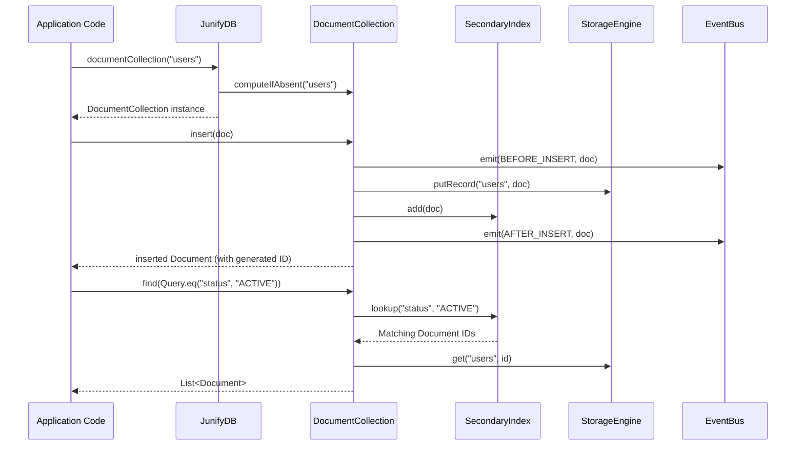

# JNOSQL-EMBED: Current Architecture Documentation

## Physical Codebase Layout

The current repository is organized into a core multi-engine library and framework adapters:

```
JNoSQL-EMBED/
├── pom.xml                                  (Root build file for junify-db-core)
├── src/main/java/org/junify/db/
│   ├── JunifyDB.java                        (Main engine facade)
│   ├── config/                              (JunifyDBConfig builder & options)
│   ├── console/http/                        (Embedded HTTP server & REST console)
│   ├── core/
│   │   ├── cdc/                             (Change Data Capture engine)
│   │   ├── event/                           (In-process EventBus)
│   │   ├── metrics/                         (Database metrics counters & JFR)
│   │   ├── record/                          (UnifiedRecord interface & metadata)
│   │   └── util/                            (JsonSerde & ChecksumUtil)
│   ├── index/                               (SecondaryIndex, B-Tree, HNSW vector stub)
│   ├── nosql/
│   │   ├── column/                          (ColumnFamily)
│   │   ├── document/                        (Document, DocumentCollection, Query)
│   │   └── kv/                              (KeyValueBucket, ListBucket, SetBucket, HashBucket)
│   ├── storage/spi/                         (StorageEngine, InMemory, File, LSM, BTree)
│   └── transaction/mvcc/                    (Transaction, MVCCManager)
├── spring-boot-starter/                     (Spring Boot 3.x Starter)
│   ├── pom.xml
│   └── src/main/java/org/junify/db/spring/boot/
├── quarkus-extension/                       (Quarkus 3.x Extension)
│   ├── pom.xml
│   ├── runtime/                             (Runtime module: JunifyConfig, Producer, Recorder)
│   └── deployment/                          (Deployment module: JunifyExtensionProcessor)
└── micronaut-integration/                   (Micronaut 4.x Integration)
    ├── pom.xml
    └── src/main/java/org/junify/db/micronaut/
```

---

## Core Component Interactions



---

## Subsystem Lifecycle

1. **Instantiation**: `JunifyDB db = JunifyDB.embed().storageEngine(type).build()`. The `StorageEngine` is instantiated based on configuration (`IN_MEMORY`, `FILE`, `B_TREE`, `LSM_TREE`).
2. **Execution**: Multiple concurrent threads access collections and buckets without external locking. Concurrent hash tables coordinate namespace isolation.
3. **Flushing & Persistence**: If `autoFlush` is active, background thread pools flush mutations to disk periodically (default 1000ms).
4. **Shutdown**: `db.close()` invokes `engine.flush()`, closes file channels, stops background timers, and shuts down any active HTTP management server.
