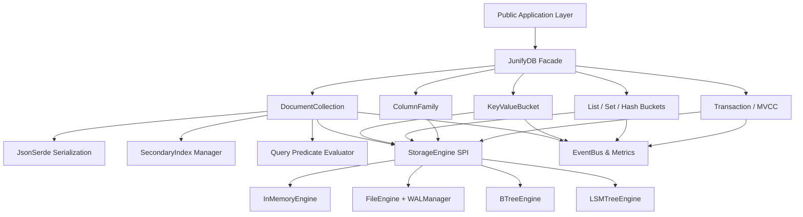

# JNOSQL-EMBED: Feature Dependencies Graph

This document details the inter-dependencies between subsystems and features within JNOSQL-EMBED.

---

## Subsystem Dependency Hierarchy

---

## Critical Invariants

1. **StorageEngine Independence**: The high-level data abstractions (`DocumentCollection`, `KeyValueBucket`, `ListBucket`, etc.) depend strictly on the `StorageEngine` interface, never on a concrete engine class. Any new `StorageEngine` automatically supports all data models.
2. **Serialization Layer**: `JsonSerde` depends on Jackson Databind, but is encapsulated internally. High-level client code interacts with `Document` records and Java maps/primitives.
3. **Transaction Buffering**: `Transaction` wraps `StorageEngine` and provides an uncommitted write layer before persisting mutations.
