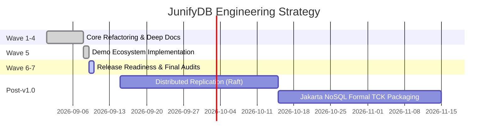

# Implementation Plan & Engineering Strategy

## Strategy Overview
JunifyDB aims to become the standard embedded NoSQL database for the JVM, mirroring H2's ubiquitous presence in the relational world. To achieve this, the project adheres to a structured, wave-based engineering roadmap.

---

## Strategic Phases

---

## Architectural Principles
1. **Zero External Daemon Dependencies**:
   - The database must run 100% inside the host JVM process without requiring native C++ drivers, Docker containers, or separate database servers.
2. **Deterministic Durability**:
   - Write-Ahead Log (WAL) fsync operations must guarantee crash consistency across power failures and process crashes.
3. **Ergonomic Multi-Model Access**:
   - No complex ORM mapping required. Native Java Records, Maps, and Lists map directly to Document, KV, and Wide-Column models.
4. **Pluggable Architecture**:
   - Storage engines, event listeners, and serialization formats must remain modular via SPI interfaces.
